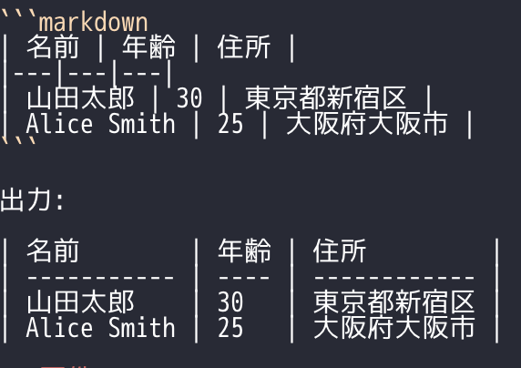

# MCP Markdown Table Formatter

Markdown テーブルの列幅を、全角 (CJK) / 半角文字の表示幅を考慮して自動的に揃える MCP サーバー。

## 動作例



## 要件

- Python 3.12+
- [uv](https://docs.astral.sh/uv/)

## インストール

```bash
claude mcp add -s user md-table-formatter -- uvx --from /path/to/md-table-formatter md-table-formatter
```

`/path/to/md-table-formatter` はこのリポジトリのクローン先パスに置き換えること。

## テスト

```bash
uv run --group dev pytest -v
```

## 仕組み

- `unicodedata.east_asian_width()` で文字幅を判定 (F, W = 幅 2、それ以外 = 幅 1)
- 各列の最大表示幅を算出し、セルを右スペースでパディング
- セパレータ行は最大幅に合わせてハイフンを生成
- アライメントは左寄せ固定、パイプ前後は 1 スペース固定

## MCP ツール

| ツール名              | 引数       | 説明                                              |
| --------------------- | ---------- | ------------------------------------------------- |
| format_markdown_table | table_text | Markdown テーブル文字列を整形して返す             |
| format_markdown_file  | file_path  | Markdown ファイル内の全テーブルを整形して書き戻す |

## Claude Code での利用

`~/.claude/CLAUDE.md` に以下を追記すると、テーブル出力時に自動的に整形される。

```markdown
### Markdown Table Formatting

- Markdown ファイルにテーブルを書き込んだ際は、format_markdown_file ツールで整形する
```
