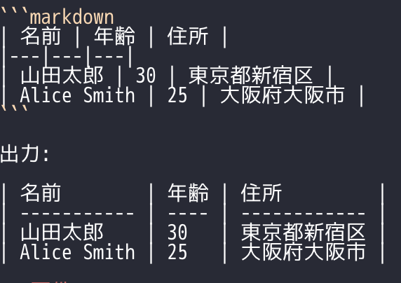

# MCP Markdown Table Formatter

Markdown テーブルの列幅を、全角 (CJK) / 半角文字の表示幅を考慮して自動的に揃える MCP サーバー。

## 動作例



## 要件

- Python 3.12+
- [uv](https://docs.astral.sh/uv/)

## インストール

```bash
claude mcp add -s user md-table-formatter -- uvx --from /path/to/mcp-md-table-formatter md-table-formatter
```

`/path/to/mcp-md-table-formatter` はこのリポジトリのクローン先パスに置き換えること。

## アップグレード

mcp 1.x 系で導入済みのユーザは [docs/migrate-mcp-2.0.md](docs/migrate-mcp-2.0.md) を参照。

## テスト

```bash
uv run --group dev pytest -v
```

## 仕組み

- `unicodedata.east_asian_width()` で文字幅を判定 (F, W = 幅 2、それ以外 = 幅 1)
- 各列の最大表示幅を算出し、セルを右スペースでパディング
- セパレータ行は最大幅に合わせて生成し、GFM のアライメント指定 (`:-` / `-:` / `:-:`) は保持
- セル内テキストは常に左詰めパディング、パイプ前後は 1 スペース固定

## MCP ツール

| ツール名             | 引数                | 説明                                              |
| -------------------- | ------------------- | ------------------------------------------------- |
| format_markdown_file | file_path, cjk_mode | Markdown ファイル内の全テーブルを整形して書き戻す |

### 引数

| 引数      | 型   | 既定値 | 説明                                                        |
| --------- | ---- | ------ | ----------------------------------------------------------- |
| file_path | str  | 必須   | 対象ファイルの絶対パス (.md のみ、他の拡張子はエラー)       |
| cjk_mode  | bool | false  | true で East Asian Ambiguous 文字を ASCII 置換せず幅 2 扱い |

既定の `false` では、フォントによって幅が変わる記号 (×, ※, →, ≠ など) を ASCII 等価物 (x, \*, ->, != など) に置換したうえで幅 1 として扱う。`cjk_mode=true` にすると置換せず原字のまま幅 2 で桁を合わせる。

ただし `cjk_mode=true` で整形した表は CJK フォント前提で幅を計算するため、Western フォントで表示するとパイプ位置がずれる。可搬性が必要な場合は既定の false のままにする。

## Claude Code での利用

`~/.claude/CLAUDE.md` に以下を追記すると、テーブル出力時に自動的に整形される。

```markdown
### Markdown Table Formatting

- Markdown ファイルにテーブルを書き込んだ際は、format_markdown_file ツールで整形する
```
